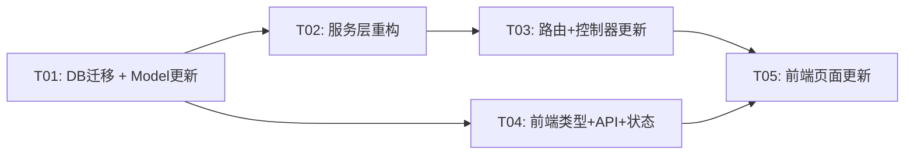
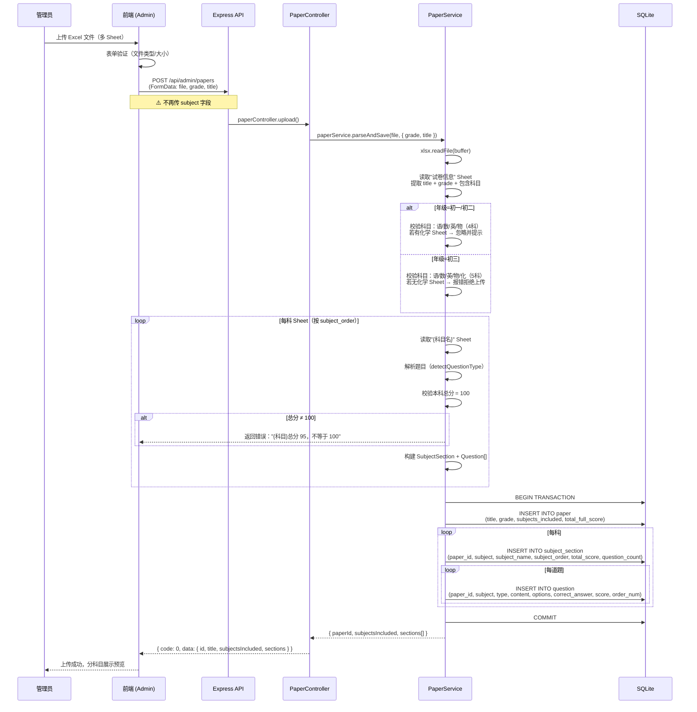
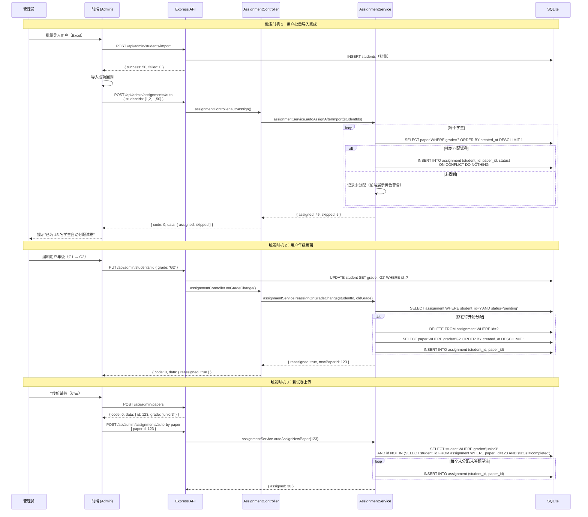
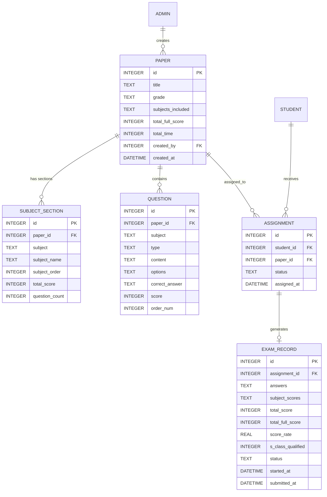

# 在线考试系统 — 增量架构设计文档 v1.1

> **作者**：高见远（架构师）  
> **日期**：2026-05-20  
> **版本**：v1.1（增量，基于 v1.0）  
> **参考 PRD**：`PRD-INCREMENTAL.md` + `PRD.md`  
> **关联文档**：`ARCHITECTURE.md`（v1.0 基线）

---

## 一、变更总览

| 变更维度 | v1.0 | v1.1 |
|----------|-------|-------|
| 试卷模型 | 一试卷一科目 | 一试卷多科目（语/数/英/物/化），化学仅初三 |
| 判分粒度 | 整卷总分 | 按科目分别计分，每科满分 100 |
| S 班资格 | （v1.0 未定义） | 所有科目均 ≥ 60% |
| 试卷分配 | 销售手动分配 | 系统按年级自动分配 + 销售可手动覆盖 |
| 用户科目字段 | `subjects` 多选 | 保留字段但前端隐藏（试卷天然覆盖全科） |
| 试卷上传格式 | 单 Sheet | Excel 多 Sheet（`试卷信息` + 各科） |

---

## 二、数据库增量变更

### 2.1 变更前后对比

#### `paper` 表

| 字段 | v1.0 | v1.1 | 变更类型 |
|------|-------|-------|---------|
| `subject` | `TEXT NOT NULL` | — | ❌ 移除 |
| `subjects_included` | — | `TEXT`（JSON 数组） | ✅ 新增 |
| `total_score` | 各题分值之和 | `subjects_included.length × 100` | 🔄 语义变化 |

#### `question` 表

| 字段 | v1.0 | v1.1 | 变更类型 |
|------|-------|-------|---------|
| `subject` | — | `TEXT NOT NULL` | ✅ 新增 |

#### `exam_record` 表

| 字段 | v1.0 | v1.1 | 变更类型 |
|------|-------|-------|---------|
| `subject_scores` | — | `TEXT`（JSON） | ✅ 新增 |
| `s_class_qualified` | — | `INTEGER DEFAULT 0` | ✅ 新增 |
| `total_full_score` | — | `INTEGER` | ✅ 新增（v1.0 隐含计算） |

#### 新增 `subject_section` 表

```sql
CREATE TABLE IF NOT EXISTS subject_section (
    id             INTEGER PRIMARY KEY AUTOINCREMENT,
    paper_id       INTEGER NOT NULL REFERENCES paper(id) ON DELETE CASCADE,
    subject        TEXT    NOT NULL,   -- chinese/math/english/physics/chemistry
    subject_name   TEXT    NOT NULL,   -- 展示名：语文/数学/...
    subject_order  INTEGER NOT NULL,   -- 排序：1=语文,2=数学,...
    total_score    INTEGER NOT NULL DEFAULT 100,
    question_count INTEGER NOT NULL DEFAULT 0,
    UNIQUE(paper_id, subject)
);
```

### 2.2 完整增量 SQL

```sql
-- ============================================================
-- v1.0 → v1.1 增量迁移 SQL
-- 执行前请备份 exam.db
-- ============================================================

-- 1. 新增 subject_section 表
CREATE TABLE IF NOT EXISTS subject_section (
    id             INTEGER PRIMARY KEY AUTOINCREMENT,
    paper_id       INTEGER NOT NULL REFERENCES paper(id) ON DELETE CASCADE,
    subject        TEXT    NOT NULL,
    subject_name   TEXT    NOT NULL,
    subject_order  INTEGER NOT NULL,
    total_score    INTEGER NOT NULL DEFAULT 100,
    question_count INTEGER NOT NULL DEFAULT 0,
    UNIQUE(paper_id, subject)
);

-- 2. paper 表变更
-- 2.1 新增 subjects_included 字段（JSON 数组）
ALTER TABLE paper ADD COLUMN subjects_included TEXT;

-- 2.2 新增 total_full_score 字段（显式存储）
ALTER TABLE paper ADD COLUMN total_full_score INTEGER;

-- 2.3 移除 subject 字段（SQLite 不支持 DROP COLUMN 需重建表）
-- ⚠️ SQLite 3.35.0+ 支持 ALTER TABLE DROP COLUMN
-- 若版本较低，需执行表重建（见 2.4）
ALTER TABLE paper DROP COLUMN subject;

-- 2.4 【兼容方案】若 SQLite 版本 < 3.35.0，执行以下步骤：
/*
CREATE TABLE paper_new (
    id                INTEGER PRIMARY KEY AUTOINCREMENT,
    title             TEXT    NOT NULL,
    grade             INTEGER NOT NULL,
    total_score       INTEGER NOT NULL DEFAULT 0,
    total_time        INTEGER NOT NULL DEFAULT 60,
    created_by        INTEGER REFERENCES admin(id),
    created_at        DATETIME DEFAULT CURRENT_TIMESTAMP,
    subjects_included TEXT,
    total_full_score  INTEGER
);
INSERT INTO paper_new SELECT id, title, grade, total_score, total_time, created_by, created_at, NULL, NULL FROM paper;
DROP TABLE paper;
ALTER TABLE paper_new RENAME TO paper;
*/

-- 3. question 表变更
ALTER TABLE question ADD COLUMN subject TEXT;

-- 4. exam_record 表变更
ALTER TABLE exam_record ADD COLUMN subject_scores TEXT;      -- JSON: SubjectScore[]
ALTER TABLE exam_record ADD COLUMN s_class_qualified INTEGER DEFAULT 0;  -- 0/1
ALTER TABLE exam_record ADD COLUMN total_full_score INTEGER;

-- 5. 新增索引
CREATE INDEX IF NOT EXISTS idx_question_subject ON question(subject);
CREATE INDEX IF NOT EXISTS idx_section_paper   ON subject_section(paper_id);

-- 6. 数据迁移（v1.0 → v1.1）
-- 6.1 旧试卷 subjects_included 推断（假设 v1.0 数据均为 4 科）
UPDATE paper SET
  subjects_included = CASE
    WHEN grade = 3 THEN '["chinese","math","english","physics","chemistry"]'
    ELSE '["chinese","math","english","physics"]'
  END,
  total_full_score = CASE
    WHEN grade = 3 THEN 500
    ELSE 400
  END
WHERE subjects_included IS NULL;

-- 6.2 旧题目 subject 字段需重新上传试卷后回填（标记旧试卷为"待升级"）
UPDATE paper SET title = '[待升级]' || title WHERE id IN (
  SELECT p.id FROM paper p
  LEFT JOIN subject_section ss ON ss.paper_id = p.id
  WHERE ss.id IS NULL
);
```

### 2.3 迁移脚本设计

```typescript
// backend/src/migrations/v1.1.0.ts
export function migrateV1_1_0(db: Database): void {
  const migrations = [
    `CREATE TABLE IF NOT EXISTS subject_section (...)`,
    `ALTER TABLE paper ADD COLUMN subjects_included TEXT`,
    // ... 按上述 SQL 顺序执行
  ];

  const applied = db.prepare(`SELECT key FROM migrations WHERE key = ?`);
  for (const sql of migrations) {
    const key = sha256(sql);  // 简单去重
    if (!applied.get(key)) {
      db.exec(sql);
      db.prepare(`INSERT INTO migrations (key, applied_at) VALUES (?, ?)`).run(key, Date.now());
    }
  }
}
```

> **建议**：在 `backend/src/models/db.ts` 初始化时自动执行迁移。

---

## 三、接口变更详细 Diff

### 3.1 管理端 — 试卷上传 `POST /api/admin/papers`

#### 请求体变更

```diff
- FormData: { file, grade, subject, title }
+ FormData: { file, grade, title }
               ↑ subject 字段移除
```

#### 响应体变更

```diff
  // 成功响应
  {
    code: 0,
    data: {
      id: number,
      title: string,
+     grade: string,
+     subjects_included: string[],       // 新增
+     sections: SubjectSection[],        // 新增（含各科目题目）
-     questionCount: number,
+     subjectCount: number,             // 科目数（4 或 5）
+     totalQuestions: number,            // 总题目数
      totalScore: number                // 现 = subjects_included.length × 100
    }
  }

+ // 解析失败响应（按科目细分错误）
  {
    code: 5001,
    message: "试卷解析失败",
    data: {
      errors: {
        subject: 'math',
        subject_name: '数学',
        error: '总分 95，不等于 100，请调整后重新上传',
        questions: [...]   // 已解析的题目（供预览修正）
      }[]
    }
  }
```

### 3.2 管理端 — 试卷详情 `GET /api/admin/papers/:id`

```diff
  {
    code: 0,
    data: {
      paper: {
        id, title, grade,
-       subject: 'math',
+       subjects_included: ['chinese','math','english','physics'],
+       total_full_score: 400,
      },
-     questions: Question[]
+     sections: [          // 新增：按科目分组
+       {
+         subject: 'chinese',
+         subject_name: '语文',
+         subject_order: 1,
+         total_score: 100,
+         question_count: 20,
+         questions: Question[]
+       },
+       // ...
+     ]
    }
  }
```

### 3.3 管理端 — 考试记录列表 `GET /api/admin/exams`

```diff
  {
    code: 0,
    data: {
      list: [
        {
          id, student_name, grade, paper_title,
          total_score: 285,
+         total_full_score: 400,
+         score_rate: 0.7125,
+         subject_scores: [          // 新增
+           { subject: 'chinese', score: 72, full_score: 100 },
+           { subject: 'math', score: 65, full_score: 100 },
+           { subject: 'english', score: 80, full_score: 100 },
+           { subject: 'physics', score: 68, full_score: 100 }
+         ],
+         s_class_qualified: false,  // 新增
        }
      ]
    }
  }
```

### 3.4 考生端 — 考试成绩 `GET /api/student/exams/:id/result`

```diff
  {
    code: 0,
    data: {
      total_score: 285,
+     total_full_score: 400,
+     score_rate: 0.7125,
+     s_class_qualified: false,
+     subject_scores: [           // 新增：分科得分
+       { subject: 'chinese', subject_name: '语文', score: 72, full_score: 100, score_rate: 0.72 },
+       { subject: 'math', subject_name: '数学', score: 65, full_score: 100, score_rate: 0.65 },
+       // ...
+     ],
      status: 'submitted'
    }
  }
```

### 3.5 新增 — 自动分配触发（内部服务方法，不暴露 API）

```typescript
// backend/src/services/assignmentService.ts

class AssignmentService {
  /**
   * 用户导入完成后自动分配
   * 触发时机：POST /api/admin/students/import 成功后调用
   */
  autoAssignAfterImport(studentIds: number[]): { assigned: number; skipped: number };

  /**
   * 用户年级变更后重新分配
   * 触发时机：PUT /api/admin/students/:id 且 grade 变化时调用
   */
  reassignOnGradeChange(studentId: number, oldGrade: string): void;

  /**
   * 新试卷上传后自动分配给匹配年级的未答题用户
   * 触发时机：POST /api/admin/papers 成功后调用
   */
  autoAssignNewPaper(paperId: number): { assigned: number };
}
```

### 3.6 废弃接口

| 原接口 | 废弃原因 | 替代方案 |
|--------|---------|---------|
| `GET /api/admin/papers?subject=math` | `paper.subject` 字段已移除 | 改用 `GET /api/admin/papers?grade=junior3`（按年级筛选即隐含科目） |

---

## 四、增量任务列表（按依赖顺序）

> 基于 v1.0 已完成的代码，进行增量修改。任务数 ≤ 5，每任务 ≥ 3 个文件。

| 任务ID | 任务名称 | 涉及文件 | 依赖任务 | 优先级 | 估时 |
|--------|---------|---------|---------|--------|------|
| **T01** | 数据库迁移 + Model 层更新 | `backend/src/models/db.ts`（迁移脚本）<br/>`backend/src/models/paperModel.ts`（新增 `subjects_included` 字段）<br/>`backend/src/models/questionModel.ts`（新增 `subject` 字段）<br/>`backend/src/models/examModel.ts`（新增 `subject_scores` + `s_class_qualified`）<br/>`backend/src/types/paper.ts`（更新 Paper 类型）<br/>`frontend/src/types/paper.ts`（同步更新） | — | P0 | M |
| **T02** | 后端服务层重构（解析/判分/自动分配） | `backend/src/services/paperService.ts`（多 Sheet 解析 + `subject_section` 写入）<br/>`backend/src/services/examService.ts`（按科目判分 + `s_class_qualified` 计算）<br/>`backend/src/services/assignmentService.ts`（新增：自动分配逻辑） | T01 | P0 | L |
| **T03** | 后端路由 + 控制器更新 | `backend/src/controllers/admin/paperController.ts`（移除 `subject` 参数，返回 `sections`）<br/>`backend/src/controllers/admin/examController.ts`（返回 `subject_scores`）<br/>`backend/src/controllers/admin/assignmentController.ts`（集成自动分配调用）<br/>`backend/src/controllers/student/examController.ts`（返回分科成绩）<br/>`backend/src/routes/admin/paper.ts`（参数校验更新） | T02 | P0 | M |
| **T04** | 前端类型 + API + 状态管理更新 | `frontend/src/types/exam.ts`（新增 `SubjectScore` + `s_class_qualified`）<br/>`frontend/src/api/paper.ts`（上传接口移除 `subject` 参数）<br/>`frontend/src/api/exam.ts`（成绩接口更新响应类型）<br/>`frontend/src/store/examStore.ts`（存储分科成绩） | T01 | P0 | M |
| **T05** | 前端页面 UI 更新 | `frontend/src/pages/admin/paper/PaperUploadPage.tsx`（多 Sheet 上传界面）<br/>`frontend/src/pages/admin/exam/ExamDataPage.tsx`（列表新增分科列 + S 班筛选）<br/>`frontend/src/pages/admin/exam/ExamDetailPage.tsx`（详情按科目分组展示）<br/>`frontend/src/pages/exam/ResultPage.tsx`（结果页分科展示 + S 班资格提示）<br/>`frontend/src/pages/admin/assignment/AssignPage.tsx`（自动分配状态展示 + 手动调整） | T03, T04 | P0 | L |

---

## 五、任务依赖图



---

## 六、关键流程变更的时序图

### 6.1 多 Sheet 试卷解析流程



### 6.2 自动分配流程



---

## 七、Excel/Word 多科目试卷格式规范

### 7.1 Excel 格式

#### Sheet 1：试卷信息

| 字段 | 示例值 | 说明 |
|------|--------|------|
| 试卷标题 | 2026年S班入学考核（初三） | 必填 |
| 适用年级 | junior3 | 必填：junior1/junior2/junior3 |
| 包含科目 | chinese,math,english,physics,chemistry | 系统自动识别，无需手动填 |

> 前端上传时自动读取"试卷信息"Sheet 并展示识别结果，供管理员确认。

#### 各科目 Sheet 命名规范

| 科目 | Sheet 名 | 初一 | 初二 | 初三 |
|------|----------|------|------|------|
| 语文 | `语文` | ✅ | ✅ | ✅ |
| 数学 | `数学` | ✅ | ✅ | ✅ |
| 英语 | `英语` | ✅ | ✅ | ✅ |
| 物理 | `物理` | ❌ | ✅ | ✅ |
| 化学 | `化学` | ❌ | ❌ | ✅ |

#### 单科 Sheet 内部格式（与 v1.0 兼容）

| 题号 | 题型 | 题目内容 | 选项A | 选项B | 选项C | 选项D | 正确答案 | 分值 |
|------|------|---------|-------|-------|-------|-------|---------|------|
| 1 | 选择题 | 1+1=? | 1 | 2 | 3 | 4 | B | 5 |
| 2 | 填空题 | 1+1=____ | — | — | — | — | 2 | 5 |

> **校验规则**：每科 Sheet 的题目分值之和必须等于 100，否则拒绝上传并提示。

### 7.2 Word 格式

```plaintext
2026年S班入学考核（初三）

# 语文（满分100分）
1. 选择题
题目内容...
A. 选项A
B. 选项B
C. 选项C
D. 选项D
答案：B
分值：5

2. 填空题
题目内容...
答案：xxx
分值：5

# 数学（满分100分）
...

# 英语（满分100分）
...

# 物理（满分100分）
...

# 化学（满分100分）
...
```

> **识别规则**：
> - 以 `# ` 开头的行作为科目标题（如 `# 语文（满分100分）`）
> - 初三试卷必须包含 `# 化学` 章节，否则拒绝上传
> - 初一/初二出现 `# 化学` 时自动忽略并提示

---

## 八、共享约定更新（Shared Knowledge v1.1）

### 8.1 枚举值更新

```typescript
// 科目（新增 chemistry，扩展为 5 科）
type Subject = 'chinese' | 'math' | 'english' | 'physics' | 'chemistry';

// 年级（改为 junior1/junior2/junior3，与 PRD 一致）
type Grade = 'junior1' | 'junior2' | 'junior3';

// 科目排序（新增）
const SUBJECT_ORDER: Record<Subject, number> = {
  chinese:  1,
  math:     2,
  english:  3,
  physics:  4,
  chemistry: 5,
};

// 科目展示名（新增）
const SUBJECT_NAMES: Record<Subject, string> = {
  chinese:  '语文',
  math:     '数学',
  english:  '英语',
  physics:  '物理',
  chemistry: '化学',
};

// 各年级包含的科目（新增）
const GRADE_SUBJECTS: Record<Grade, Subject[]> = {
  junior1: ['chinese', 'math', 'english', 'physics'],
  junior2: ['chinese', 'math', 'english', 'physics'],
  junior3: ['chinese', 'math', 'english', 'physics', 'chemistry'],
};
```

### 8.2 判分结果接口（新增）

```typescript
interface SubjectScore {
  subject:       Subject;
  subject_name:  string;    // "语文"
  score:         number;     // 本科得分
  full_score:    number;     // 100
  score_rate:    number;     // 得分率（0~1）
  questions_answered: number;
  questions_correct:   number;
}

interface GradingResult {
  total_score:      number;       // 总分（各科之和）
  total_full_score: number;       // 总满分（400 或 500）
  score_rate:       number;       // 总分率
  subjects:         SubjectScore[];
  s_class_qualified: boolean;    // 是否达到 S 班资格
}
```

### 8.3 错误码新增

```typescript
const ERROR_CODES = {
  // ... v1.0 错误码
  PAPER_PARSE_SUBJECT_SCORE_INVALID: 5003,  // 某科总分不为 100
  PAPER_PARSE_MISSING_CHEMISTRY:      5004,  // 初三试卷缺化学
  PAPER_PARSE_UNKNOWN_SUBJECT_SHEET:  5005,  // 出现未知科目 Sheet
  AUTO_ASSIGN_NO_PAPER:               6001,  // 自动分配时无匹配试卷
};
```

---

## 九、待确认问题（Anything UNCLEAR）

| # | 问题 | 影响范围 | 建议 |
|---|------|----------|------|
| 1 | **旧试卷处理**：v1.0 上传的旧格式试卷（单科）是否需要迁移脚本批量转换，还是直接废弃让管理员重新上传？ | 数据迁移 | **建议废弃 + 提示重新上传**，成本低且避免解析错误；在 `paper.title` 前加 `[待升级]` 标记 |
| 2 | **化学初三强制**：若管理员上传初三试卷但未包含化学，系统是否直接拒绝上传，还是允许上传后告知"化学暂缺"？ | 试卷上传逻辑 | **建议初三必须含化学**，否则拒绝上传（与 PRD 一致） |
| 3 | **分科得分率 S 班判定**：各科均需 60%，还是总分率达到 60% 即可？ | 判分逻辑 | 当前设计为**各科均需 60%**（与 PRD 一致），请确认 |
| 4 | **简答题跨科目分值**：简答题按科目出题，分值计入该科。是否需要在每科内部再细分大题/小题分值？ | 试卷格式 | 当前不细分，统一按"分值"字段；如需支持，可在 `question` 表新增 `section_id` 字段 |
| 5 | **自动分配触发时机**：用户导入时自动分配，用户编辑年级时重新分配；是否需要在用户登录后自动触发分配检查？ | 分配逻辑 | **建议在"我的试卷"加载时检查**，若用户无分配记录且存在匹配试卷，则弹窗提示"检测到新试卷，是否开始考试？" |
| 6 | **手动分配优先级**：销售手动分配 vs 自动分配的冲突处理规则。是否允许同一用户同一年级有多张试卷？ | 分配逻辑 | **建议允许**，但用户端只展示最新一张（按 `created_at` 排序）；手动分配记录标记 `is_manual=1` |
| 7 | **旧 ExamRecord 数据**：v1.0 已有的考试记录，`subject_scores` 字段如何回填？是否追溯判分？ | 数据迁移 | **建议不回填**，旧记录只展示总分，`subject_scores` 为 `null`；新增字段 `migration_version` 区分 v1.0/v1.1 |
| 8 | **S 班资格可配置**：各科资格线（当前 60%）是否需要在后台可配置（如：化学 50%，其他 60%）？ | 判分规则 | 当前固定 60%，扩展为可配置可作为 **P2 功能**；建议数据库新增 `config` 表存储 `s_class_threshold` JSON |

---

## 十、附录：完整 ER 关系图（v1.1）



---

*文档结束*
