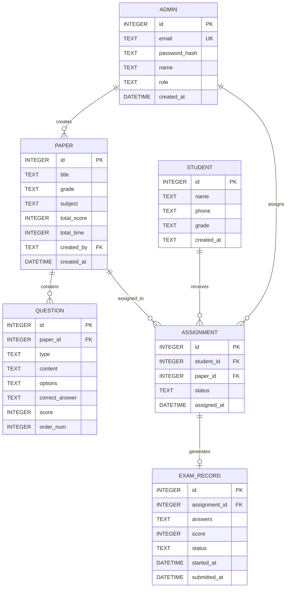
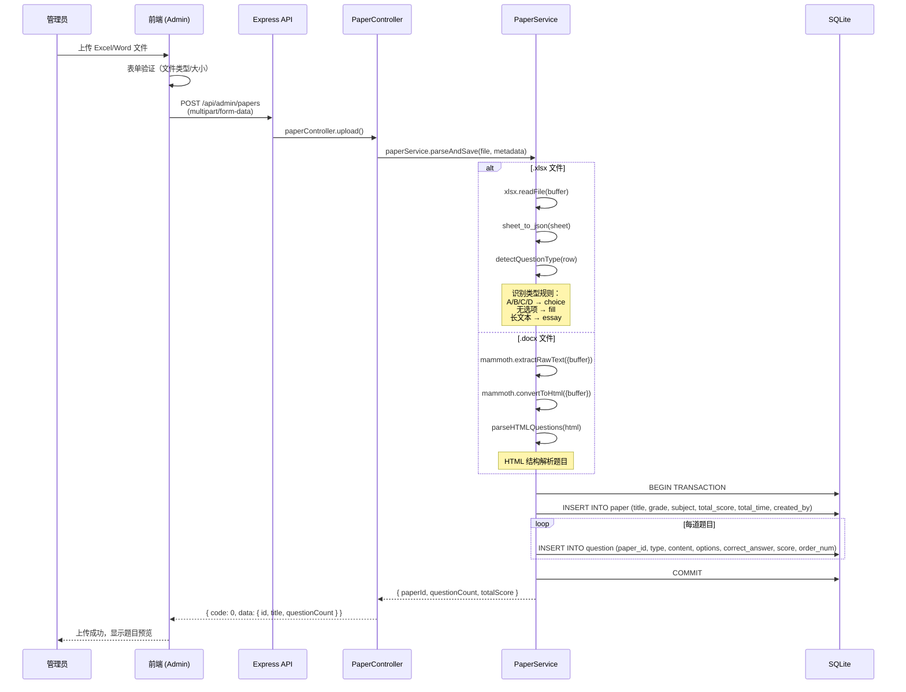
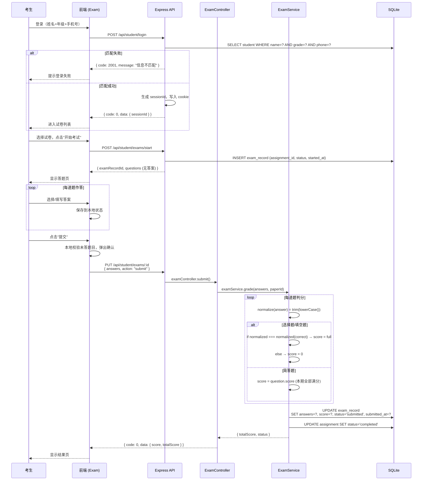
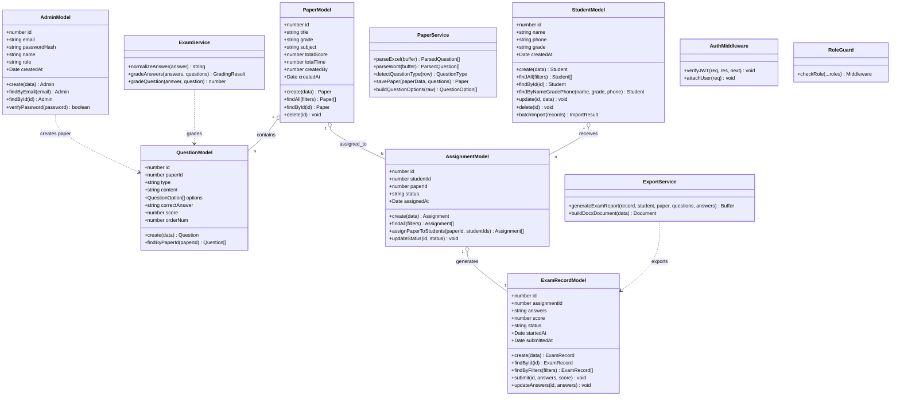
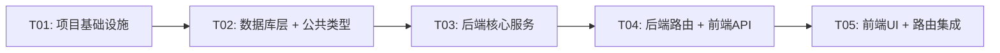

# 在线考试系统 — 系统架构设计文档

> **作者**：高见远（架构师）  
> **日期**：2026-05-20  
> **版本**：v1.0  
> **参考 PRD**：在线考试系统产品需求文档

---

## 一、技术方案概述

### 1.1 整体架构图

```mermaid
graph TB
    subgraph Client["前端 (Vite + React + MUI + Tailwind CSS)"]
        AdminWeb["管理端 Web<br/>Administrator / Tutor"]
        StudentWeb["考生端 Web<br/>Student"]
    end

    subgraph Server["后端 (Node.js + Express)"]
        API["REST API Server<br/>/api/admin/* /api/*"]
        Auth["JWT Auth Middleware"]
        Upload["File Upload Handler<br/>(multer)"]
    end

    subgraph Services["Service Layer"]
        PaperService["PaperService<br/>试卷解析/管理"]
        UserService["UserService<br/>用户管理"]
        ExamService["ExamService<br/>考试/判分"]
        ExportService["ExportService<br/>Word导出"]
    end

    subgraph Data["数据层 (SQLite)"]
        DB[(["exam.db"])]
    end

    AdminWeb -->|HTTPS| API
    StudentWeb -->|HTTPS| API
    API --> Auth
    Auth --> Upload
    Upload --> PaperService
    PaperService -->|xlsx / mammoth| Services
    UserService --> Services
    ExamService --> Services
    ExportService --> Services
    Services --> DB
```

### 1.2 前后端分离方案

```
┌──────────────────┐         ┌───────────────────────┐
│   前端 (Vite)     │  HTTP   │   后端 (Express)        │
│   localhost:5173 │ ──────► │   localhost:3001        │
│                  │ ◄────── │                        │
└──────────────────┘  JSON   └───────────────────────┘
        │                              │
   React Router                    SQLite DB
   (admin/*, exam/*)               JWT / Session
   MUI + Tailwind                  bcrypt
```

### 1.3 技术栈选型说明

| 层级 | 技术选型 | 选型理由 |
|------|---------|---------|
| 前端框架 | React 18 + Vite | 快速构建，HMR 优秀，生态成熟 |
| UI 组件 | MUI v5 + Tailwind CSS | MUI 提供基础组件，Taliwnd 补充自定义样式 |
| 状态管理 | Zustand | 轻量、无 boilerplate，比 Redux 适合中小型项目 |
| HTTP 客户端 | Axios | 拦截器完善，易于统一处理错误和 token |
| 后端框架 | Express | 稳定、文档完善、中间件生态丰富 |
| 数据库 | SQLite (better-sqlite3) | 开发阶段零配置，单文件便于交付；better-sqlite3 为同步 API 更易用 |
| Excel 解析 | xlsx (SheetJS) | 支持 .xlsx/.csv，内存解析无需 OLE Automation |
| Word 解析 | mammoth | Node.js 原生 DOCX → HTML 解析，零依赖 |
| Word 导出 | docx | 纯 JS 生成 .docx，无需 Office COM |
| 密码加密 | bcrypt | 加盐哈希，行业标准 |
| 鉴权 | jsonwebtoken (管理端) + cookie (考生端) | 管理端 JWT 适合无状态 API，考生端 cookie 防止 URL 泄露 token |
| 文件上传 | multer | Express 官方推荐，支持磁盘存储和文件大小限制 |

### 1.4 运行方式

```bash
# 前端开发
cd frontend && npm install && npm run dev   # localhost:5173

# 后端开发
cd backend && npm install && npm run dev   # localhost:3001

# 生产构建
cd frontend && npm run build               # 输出 dist/
```

> **注意**：前端 Vite dev server 配置代理，将 `/api` 请求转发至 `http://localhost:3001`，避免跨域。

---

## 二、目录结构（完整文件列表）

```
exam-system/
├── frontend/                         # Vite + React 项目
│   ├── public/
│   │   └── vite.svg
│   ├── src/
│   │   ├── assets/
│   │   │   └── logo.svg
│   │   ├── components/              # 共用 UI 组件
│   │   │   ├── ui/
│   │   │   │   ├── LoadingSpinner.tsx
│   │   │   │   ├── ErrorAlert.tsx
│   │   │   │   └── ConfirmDialog.tsx
│   │   │   └── layout/
│   │   │       ├── AdminLayout.tsx    # 管理端布局（侧边栏+顶栏）
│   │   │       └── StudentLayout.tsx  # 考生端布局
│   │   ├── pages/
│   │   │   ├── admin/                # 管理端页面
│   │   │   │   ├── LoginPage.tsx
│   │   │   │   ├── DashboardPage.tsx
│   │   │   │   ├── paper/
│   │   │   │   │   ├── PaperListPage.tsx
│   │   │   │   │   └── PaperUploadPage.tsx
│   │   │   │   ├── user/
│   │   │   │   │   ├── UserListPage.tsx
│   │   │   │   │   └── UserImportPage.tsx
│   │   │   │   ├── assignment/
│   │   │   │   │   ├── AssignPage.tsx
│   │   │   │   │   └── AssignBatchPage.tsx
│   │   │   │   └── exam/
│   │   │   │       ├── ExamDataPage.tsx
│   │   │   │       └── ExamDetailPage.tsx
│   │   │   └── exam/                 # 用户端页面
│   │   │       ├── LoginPage.tsx
│   │   │       ├── PaperListPage.tsx
│   │   │       ├── ExamPage.tsx
│   │   │       └── ResultPage.tsx
│   │   ├── api/                     # API 调用封装
│   │   │   ├── index.ts             # Axios 实例配置
│   │   │   ├── auth.ts              # 认证相关 API
│   │   │   ├── paper.ts             # 试卷相关 API
│   │   │   ├── user.ts              # 用户相关 API
│   │   │   ├── assignment.ts        # 分配相关 API
│   │   │   └── exam.ts              # 考试相关 API
│   │   ├── store/                   # Zustand 状态管理
│   │   │   ├── authStore.ts         # 管理端认证状态
│   │   │   ├── studentStore.ts      # 考生端状态
│   │   │   └── examStore.ts         # 答题状态
│   │   ├── types/                   # TypeScript 类型定义
│   │   │   ├── index.ts             # 公共类型（API响应、枚举）
│   │   │   ├── paper.ts             # 试卷相关类型
│   │   │   ├── user.ts              # 用户相关类型
│   │   │   └── exam.ts              # 考试相关类型
│   │   ├── utils/                   # 工具函数
│   │   │   ├── validators.ts        # 表单校验
│   │   │   ├── formatters.ts        # 日期、分数格式化
│   │   │   └── storage.ts           # localStorage / sessionStorage 封装
│   │   ├── router/                  # 路由配置
│   │   │   └── index.tsx            # React Router v6 路由表
│   │   ├── theme/                   # MUI 主题配置
│   │   │   └── index.ts
│   │   ├── App.tsx
│   │   └── main.tsx
│   ├── index.html
│   ├── vite.config.ts
│   ├── tailwind.config.js
│   ├── postcss.config.js
│   ├── tsconfig.json
│   └── package.json
│
├── backend/                          # Node.js Express 项目
│   ├── src/
│   │   ├── routes/                  # 路由定义
│   │   │   ├── index.ts             # 路由汇总
│   │   │   ├── admin/
│   │   │   │   ├── auth.ts          # 管理端登录注册
│   │   │   │   ├── paper.ts         # 试卷管理
│   │   │   │   ├── user.ts          # 用户管理
│   │   │   │   ├── assignment.ts    # 分配试卷
│   │   │   │   └── exam.ts          # 考试数据
│   │   │   └── student/
│   │   │       └── index.ts         # 考生端路由
│   │   ├── controllers/             # 请求处理
│   │   │   ├── admin/
│   │   │   │   ├── authController.ts
│   │   │   │   ├── paperController.ts
│   │   │   │   ├── userController.ts
│   │   │   │   ├── assignmentController.ts
│   │   │   │   └── examController.ts
│   │   │   └── student/
│   │   │       └── examController.ts
│   │   ├── services/                # 业务逻辑
│   │   │   ├── authService.ts
│   │   │   ├── paperService.ts      # 试卷解析（xlsx/mammoth）
│   │   │   ├── userService.ts
│   │   │   ├── examService.ts       # 判分逻辑
│   │   │   └── exportService.ts     # Word 导出
│   │   ├── models/                  # 数据访问
│   │   │   ├── db.ts                # SQLite 连接初始化
│   │   │   ├── paperModel.ts
│   │   │   ├── userModel.ts
│   │   │   ├── assignmentModel.ts
│   │   │   └── examModel.ts
│   │   ├── middlewares/             # 中间件
│   │   │   ├── auth.ts              # JWT 验证
│   │   │   ├── roleGuard.ts         # 角色权限校验
│   │   │   ├── upload.ts            # multer 文件上传
│   │   │   ├── errorHandler.ts      # 全局错误处理
│   │   │   └── validator.ts         # 请求参数校验
│   │   ├── utils/                   # 工具函数
│   │   │   ├── logger.ts
│   │   │   └── helpers.ts
│   │   ├── config/
│   │   │   └── index.ts             # 环境变量配置
│   │   └── app.ts                   # Express 应用入口
│   ├── uploads/                     # 临时上传目录
│   ├── data/                        # SQLite 数据库文件目录
│   │   └── exam.db
│   ├── tsconfig.json
│   ├── package.json
│   └── .env.example
│
└── docs/
    ├── ARCHITECTURE.md              # 本文档
    ├── class-diagram.mermaid        # 类图（Mermaid 源码）
    └── sequence-diagram.mermaid      # 时序图（Mermaid 源码）
```

---

## 三、数据库设计（SQLite）

### 3.1 ER 关系图



### 3.2 建表 SQL

```sql
-- 用户表：管理员/辅导老师
CREATE TABLE IF NOT EXISTS admin (
    id           INTEGER PRIMARY KEY AUTOINCREMENT,
    email        TEXT    NOT NULL UNIQUE,
    password_hash TEXT   NOT NULL,
    name         TEXT    NOT NULL,
    role         TEXT    NOT NULL DEFAULT 'tutor',  -- admin | tutor
    created_at   DATETIME DEFAULT CURRENT_TIMESTAMP
);

-- 考生表
CREATE TABLE IF NOT EXISTS student (
    id         INTEGER PRIMARY KEY AUTOINCREMENT,
    name       TEXT    NOT NULL,
    phone      TEXT    NOT NULL,
    grade      TEXT    NOT NULL,  -- ENUM: G1-G6
    created_at DATETIME DEFAULT CURRENT_TIMESTAMP,
    UNIQUE(name, phone, grade)    -- 登录时三者唯一确定身份
);

-- 试卷表
CREATE TABLE IF NOT EXISTS paper (
    id           INTEGER PRIMARY KEY AUTOINCREMENT,
    title        TEXT    NOT NULL,
    grade        TEXT    NOT NULL,
    subject      TEXT    NOT NULL,  -- ENUM: math | chinese | english
    total_score  INTEGER NOT NULL DEFAULT 0,
    total_time   INTEGER NOT NULL DEFAULT 60,
    created_by   INTEGER REFERENCES admin(id),
    created_at   DATETIME DEFAULT CURRENT_TIMESTAMP
);

-- 题目表
CREATE TABLE IF NOT EXISTS question (
    id             INTEGER PRIMARY KEY AUTOINCREMENT,
    paper_id       INTEGER NOT NULL REFERENCES paper(id) ON DELETE CASCADE,
    type           TEXT    NOT NULL,  -- ENUM: choice | fill | essay
    content        TEXT    NOT NULL,
    options        TEXT,              -- JSON: [{"label":"A","text":"..."}]
    correct_answer TEXT    NOT NULL,
    score          INTEGER NOT NULL DEFAULT 5,
    order_num      INTEGER NOT NULL DEFAULT 0
);

-- 分配表
CREATE TABLE IF NOT EXISTS assignment (
    id          INTEGER PRIMARY KEY AUTOINCREMENT,
    student_id  INTEGER NOT NULL REFERENCES student(id) ON DELETE CASCADE,
    paper_id    INTEGER NOT NULL REFERENCES paper(id) ON DELETE CASCADE,
    status      TEXT    NOT NULL DEFAULT 'pending',  -- pending | in_progress | completed
    assigned_at DATETIME DEFAULT CURRENT_TIMESTAMP,
    UNIQUE(student_id, paper_id)
);

-- 考试记录表
CREATE TABLE IF NOT EXISTS exam_record (
    id             INTEGER PRIMARY KEY AUTOINCREMENT,
    assignment_id  INTEGER NOT NULL REFERENCES assignment(id) ON DELETE CASCADE,
    answers        TEXT,            -- JSON: [{"qid":1,"answer":"A"},{"qid":2,"answer":"..."}]
    score          INTEGER,
    status         TEXT    NOT NULL DEFAULT 'in_progress',  -- in_progress | submitted | graded
    started_at     DATETIME,
    submitted_at   DATETIME
);
```

### 3.3 索引

```sql
CREATE INDEX IF NOT EXISTS idx_student_grade   ON student(grade);
CREATE INDEX IF NOT EXISTS idx_paper_grade    ON paper(grade);
CREATE INDEX IF NOT EXISTS idx_paper_subject  ON paper(subject);
CREATE INDEX IF NOT EXISTS idx_question_paper ON question(paper_id);
CREATE INDEX IF NOT EXISTS idx_assignment_student ON assignment(student_id);
CREATE INDEX IF NOT EXISTS idx_exam_assignment  ON exam_record(assignment_id);
```

---

## 四、API 接口设计

### 4.1 统一响应格式

```typescript
// 成功
{ "code": 0, "message": "操作成功", "data": {...} }
// 错误
{ "code": 1001, "message": "用户名或密码错误", "data": null }
```

### 4.2 管理端 API — 认证模块 `/api/admin/auth`

| 方法 | 路径 | 说明 | 权限 |
|------|------|------|------|
| POST | `/api/admin/auth/register` | 注册（仅 Administrator） | admin |
| POST | `/api/admin/auth/login` | 登录 | 公开 |
| GET | `/api/admin/auth/me` | 获取当前用户信息 | JWT |

```typescript
// POST /api/admin/auth/register
// Request: { email: string, password: string, name: string, role: "admin"|"tutor" }
// Response: { code, message, data: { id, email, name, role } }

// POST /api/admin/auth/login
// Request: { email: string, password: string }
// Response: { code, message, data: { token: string, user: { id, email, name, role } } }
// Header: Set-Cookie: token=<jwt>; HttpOnly; Path=/

// GET /api/admin/auth/me
// Response: { code, message, data: { id, email, name, role } }
```

### 4.3 管理端 API — 试卷管理 `/api/admin/papers`

| 方法 | 路径 | 说明 | 权限 |
|------|------|------|------|
| GET | `/api/admin/papers` | 试卷列表（分页+筛选） | JWT |
| POST | `/api/admin/papers` | 上传并解析试卷 | admin |
| GET | `/api/admin/papers/:id` | 试卷详情 | JWT |
| GET | `/api/admin/papers/:id/preview` | 预览试卷（不含答案） | JWT |
| DELETE | `/api/admin/papers/:id` | 删除试卷 | admin |

```typescript
// GET /api/admin/papers?grade=G1&subject=math&page=1&pageSize=20
// Response: { code, message, data: { list: Paper[], total, page, pageSize } }

// POST /api/admin/papers  (Content-Type: multipart/form-data)
// FormData: { file: File, grade: string, subject: string, title: string }
// Response: { code, message, data: { id, title, questionCount, totalScore } }
// 成功后返回已解析的题目列表（管理员可见答案）

// GET /api/admin/papers/:id/preview
// Response: { code, message, data: { paper, questions: Omit<Question, 'correct_answer'>[] } }
// ⚠️ 不含 correct_answer 字段

// GET /api/admin/papers/:id
// Response: { code, message, data: { paper, questions } }
// ⚠️ 管理员完整可见含答案的详情
```

### 4.4 管理端 API — 用户管理 `/api/admin/students`

| 方法 | 路径 | 说明 | 权限 |
|------|------|------|------|
| GET | `/api/admin/students` | 考生列表（分页+筛选） | JWT |
| POST | `/api/admin/students` | 单独新增考生 | JWT |
| POST | `/api/admin/students/import` | 批量导入考生 | JWT |
| PUT | `/api/admin/students/:id` | 编辑考生信息 | JWT |
| DELETE | `/api/admin/students/:id` | 删除考生 | JWT |

```typescript
// GET /api/admin/students?grade=G1&subject=math&page=1&pageSize=50
// Response: { code, message, data: { list: Student[], total } }

// POST /api/admin/students
// Request: { name: string, phone: string, grade: string, subjects: string[] }
// Response: { code, message, data: Student }

// POST /api/admin/students/import  (Content-Type: multipart/form-data)
// FormData: { file: File }
// 支持 .xlsx / .csv，字段：姓名, 手机号, 年级, 科目（多选逗号分隔）
// Response: { code, message, data: { success: number, failed: number, errors: string[] } }

// PUT /api/admin/students/:id
// Request: { name?: string, phone?: string, grade?: string, subjects?: string[] }
// DELETE /api/admin/students/:id
// Response: { code, message, data: null }
```

### 4.5 管理端 API — 分配试卷 `/api/admin/assignments`

| 方法 | 路径 | 说明 | 权限 |
|------|------|------|------|
| POST | `/api/admin/assignments` | 分配试卷（单个/批量） | JWT |
| GET | `/api/admin/assignments` | 分配记录列表 | JWT |
| GET | `/api/admin/assignments/preview` | 分配预览（不实际创建） | JWT |

```typescript
// POST /api/admin/assignments
// Request: { paperId: number, studentIds: number[] }
// 或批量: { paperId: number, grade?: string, studentIds?: number[] }
// Response: { code, message, data: { assigned: number, skipped: number } }

// GET /api/admin/assignments?studentId=1&paperId=1&page=1&pageSize=20
// Response: { code, message, data: { list: Assignment[], total } }

// GET /api/admin/assignments/preview
// Query: ?paperId=1&studentIds=1,2,3 或 ?paperId=1&grade=G1
// Response: { code, message, data: { students: Student[], paper: Paper, conflictCount: number } }
```

### 4.6 管理端 API — 考试数据 `/api/admin/exams`

| 方法 | 路径 | 说明 | 权限 |
|------|------|------|------|
| GET | `/api/admin/exams` | 考试记录列表 | JWT |
| GET | `/api/admin/exams/:id` | 考试详情（含判分详情） | JWT |
| POST | `/api/admin/exams/:id/export` | 导出 Word 报告 | JWT |

```typescript
// GET /api/admin/exams?grade=G1&minScore=60&maxScore=100&paperId=1&page=1&pageSize=20
// Response: { code, message, data: { list: ExamRecord[], total } }
// 返回记录含 studentName, paperTitle, grade, score, status, startedAt, submittedAt
// ⚠️ 不含答案信息

// GET /api/admin/exams/:id
// Response: { code, message, data: { record, student, paper, questions, studentAnswers } }
// ⚠️ 返回题目及正确答案，供管理员查看判分详情

// POST /api/admin/exams/:id/export
// Response: 文件流 (application/vnd.openxmlformats-officedocument.wordprocessingml.document)
// 文件名: 考试报告_{考生姓名}_{试卷名称}_{日期}.docx
```

### 4.7 用户端（考生）API `/api/student`

| 方法 | 路径 | 说明 | 鉴权 |
|------|------|------|------|
| POST | `/api/student/login` | 考生登录 | 公开 |
| GET | `/api/student/papers` | 我的试卷列表 | cookie |
| GET | `/api/student/papers/:id/exam` | 获取答题内容 | cookie |
| POST | `/api/student/exams/start` | 开始考试 | cookie |
| PUT | `/api/student/exams/:id` | 提交答案 | cookie |
| GET | `/api/student/exams/:id/result` | 获取成绩 | cookie |

```typescript
// POST /api/student/login
// Request: { name: string, grade: string, phone: string }
// Response: { code, message, data: { sessionId: string } }
// ⚠️ 使用 cookie session，不返回 JWT

// GET /api/student/papers
// Response: { code, message, data: { list: AssignmentWithPaper[] } }
// 不含任何答案信息

// GET /api/student/papers/:id/exam
// Response: { code, message, data: { examRecord, questions: Omit<Question,'correct_answer'>[] } }
// ⚠️ 关键：questions 不含 correct_answer，options 全部返回

// POST /api/student/exams/start
// Request: { assignmentId: number }
// Response: { code, message, data: { examRecordId, startedAt } }

// PUT /api/student/exams/:id
// Request: { answers: Array<{ questionId: number, answer: string }>, action: "save"|"submit" }
// Response: { code, message, data: { status, score?, savedAt } }
// action=submit 时触发判分

// GET /api/student/exams/:id/result
// Response: { code, message, data: { score, totalScore, status, submittedAt, answers } }
// ⚠️ 仅返回分数和提交状态，不返回正确答案
```

---

## 五、关键流程时序图

### 5.1 试卷上传解析流程



### 5.2 考生答题提交流程



---

## 六、类结构设计（Mermaid Class Diagram）



---

## 七、任务列表（按依赖顺序排列）

> 最多 5 个任务，每任务至少包含 3 个相关文件。

| 任务ID | 任务名称 | 涉及文件 | 依赖任务 | 优先级 | 估时 |
|--------|---------|---------|---------|--------|------|
| **T01** | 项目基础设施搭建 | `frontend/package.json` `frontend/vite.config.ts` `frontend/tsconfig.json` `frontend/tailwind.config.js` `frontend/index.html` `frontend/src/main.tsx` `frontend/src/App.tsx` `backend/package.json` `backend/tsconfig.json` `backend/.env.example` `backend/src/app.ts` `backend/src/config/index.ts` | — | P0 | M |
| **T02** | 数据库层 + 公共类型定义 | `backend/src/models/db.ts` `backend/src/models/paperModel.ts` `backend/src/models/userModel.ts` `backend/src/models/assignmentModel.ts` `backend/src/models/examModel.ts` `frontend/src/types/index.ts` `frontend/src/types/paper.ts` `frontend/src/types/user.ts` `frontend/src/types/exam.ts` `docs/ARCHITECTURE.md` | T01 | P0 | M |
| **T03** | 后端核心服务（认证/试卷解析/判分/导出） | `backend/src/middlewares/auth.ts` `backend/src/middlewares/roleGuard.ts` `backend/src/middlewares/errorHandler.ts` `backend/src/services/authService.ts` `backend/src/services/paperService.ts` `backend/src/services/examService.ts` `backend/src/services/exportService.ts` `frontend/src/api/index.ts` | T02 | P0 | L |
| **T04** | 后端路由层 + 前端 API 封装 | `backend/src/routes/admin/auth.ts` `backend/src/routes/admin/paper.ts` `backend/src/routes/admin/user.ts` `backend/src/routes/admin/assignment.ts` `backend/src/routes/admin/exam.ts` `backend/src/routes/student/index.ts` `backend/src/controllers/admin/*` `backend/src/controllers/student/*` `frontend/src/api/auth.ts` `frontend/src/api/paper.ts` `frontend/src/api/user.ts` `frontend/src/api/assignment.ts` `frontend/src/api/exam.ts` | T03 | P0 | L |
| **T05** | 前端 UI 页面 + 状态管理 + 路由集成 | `frontend/src/store/authStore.ts` `frontend/src/store/studentStore.ts` `frontend/src/store/examStore.ts` `frontend/src/router/index.tsx` `frontend/src/theme/index.ts` `frontend/src/components/layout/AdminLayout.tsx` `frontend/src/components/layout/StudentLayout.tsx` `frontend/src/pages/admin/LoginPage.tsx` `frontend/src/pages/admin/DashboardPage.tsx` `frontend/src/pages/admin/paper/PaperListPage.tsx` `frontend/src/pages/admin/paper/PaperUploadPage.tsx` `frontend/src/pages/admin/user/UserListPage.tsx` `frontend/src/pages/admin/assignment/AssignPage.tsx` `frontend/src/pages/admin/exam/ExamDataPage.tsx` `frontend/src/pages/exam/LoginPage.tsx` `frontend/src/pages/exam/PaperListPage.tsx` `frontend/src/pages/exam/ExamPage.tsx` `frontend/src/pages/exam/ResultPage.tsx` | T04 | P0 | L |

---

## 八、任务依赖图



---

## 九、依赖包清单

### 9.1 Frontend (`frontend/package.json`)

```json
{
  "name": "exam-system-frontend",
  "private": true,
  "version": "1.0.0",
  "type": "module",
  "scripts": {
    "dev": "vite",
    "build": "tsc && vite build",
    "preview": "vite preview"
  },
  "dependencies": {
    "react": "^18.2.0",
    "react-dom": "^18.2.0",
    "react-router-dom": "^6.22.0",
    "axios": "^1.6.7",
    "zustand": "^4.5.1",
    "@mui/material": "^5.15.10",
    "@mui/icons-material": "^5.15.10",
    "@emotion/react": "^11.11.4",
    "@emotion/styled": "^11.11.0",
    "@tanstack/react-query": "^5.24.1",
    "dayjs": "^1.11.10"
  },
  "devDependencies": {
    "@types/react": "^18.2.55",
    "@types/react-dom": "^18.2.19",
    "@vitejs/plugin-react": "^4.2.1",
    "autoprefixer": "^10.4.17",
    "postcss": "^8.4.35",
    "tailwindcss": "^3.4.1",
    "typescript": "^5.2.2",
    "vite": "^5.1.0"
  }
}
```

### 9.2 Backend (`backend/package.json`)

```json
{
  "name": "exam-system-backend",
  "version": "1.0.0",
  "description": "在线考试系统后端 API",
  "main": "dist/app.js",
  "scripts": {
    "dev": "tsx watch src/app.ts",
    "build": "tsc",
    "start": "node dist/app.js"
  },
  "dependencies": {
    "express": "^4.18.2",
    "cors": "^2.8.5",
    "better-sqlite3": "^9.4.3",
    "jsonwebtoken": "^9.0.2",
    "bcrypt": "^5.1.1",
    "multer": "^1.4.5-lts.1",
    "xlsx": "^0.18.5",
    "mammoth": "^1.6.0",
    "docx": "^8.5.0",
    "cookie-parser": "^1.4.6",
    "dotenv": "^16.4.5",
    "zod": "^3.22.4",
    "uuid": "^9.0.1"
  },
  "devDependencies": {
    "@types/express": "^4.17.21",
    "@types/cors": "^2.8.17",
    "@types/better-sqlite3": "^7.6.9",
    "@types/jsonwebtoken": "^9.0.6",
    "@types/bcrypt": "^5.0.2",
    "@types/multer": "^1.4.11",
    "@types/cookie-parser": "^1.4.7",
    "@types/uuid": "^9.0.8",
    "typescript": "^5.2.2",
    "tsx": "^4.7.1"
  }
}
```

---

## 十、共享约定（Shared Knowledge）

### 10.1 枚举值定义

```typescript
// 角色
type AdminRole = 'admin' | 'tutor';
type UserRole  = 'admin' | 'tutor' | 'student';

// 年级
type Grade = 'G1' | 'G2' | 'G3' | 'G4' | 'G5' | 'G6';

// 科目
type Subject = 'math' | 'chinese' | 'english';

// 题目类型
type QuestionType = 'choice' | 'fill' | 'essay';

// 分配状态
type AssignmentStatus = 'pending' | 'in_progress' | 'completed';

// 考试状态
type ExamStatus = 'in_progress' | 'submitted' | 'graded';

// 试卷上传支持的格式
type UploadFileType = '.xlsx' | '.xls' | '.docx';
```

### 10.2 API 响应格式

```typescript
interface ApiResponse<T = unknown> {
  code: number;      // 0 = 成功，非 0 = 错误码
  message: string;   // 操作说明
  data: T | null;
}

// 错误码约定
const ERROR_CODES = {
  SUCCESS:           0,
  BAD_REQUEST:       1000,
  UNAUTHORIZED:      1001,
  FORBIDDEN:         1002,
  NOT_FOUND:         1003,
  STUDENT_AUTH_FAIL: 2001,  // 考生登录信息不匹配
  PAPER_NOT_FOUND:   3001,
  ASSIGNMENT_EXISTS: 3002,
  EXAM_NOT_STARTED:   4001,
  EXAM_ALREADY_DONE: 4002,
  FILE_PARSE_ERROR:  5001,
  FILE_TOO_LARGE:    5002,
};
```

### 10.3 JWT Payload 结构

```typescript
interface JWTPayload {
  sub: number;       // admin.id
  email: string;
  role: AdminRole;    // 'admin' | 'tutor'
  iat: number;        // issued at
  exp: number;        // expiration (7 days)
}
```

### 10.4 考生 Session 结构

```typescript
interface StudentSession {
  sessionId: string;  // UUID v4
  studentId: number;
  name: string;
  grade: Grade;
  createdAt: string;  // ISO 8601
}
```

### 10.5 文件上传约定

```
Content-Type: multipart/form-data
maxFileSize: 10MB
allowedTypes: .xlsx, .xls, .docx
存储路径: backend/uploads/{yyyy-MM}/{uuid}.{ext}
最终路径: backend/data/exam.db (SQLite 数据库)
```

### 10.6 Excel/Word 试卷格式约定

**Excel 格式**（Sheet1，第一个 sheet）：
| 题号 | 题型 | 题目内容 | 选项A | 选项B | 选项C | 选项D | 正确答案 | 分值 |
|------|------|---------|-------|-------|-------|-------|---------|------|
| 1 | 选择题 | 1+1=? | 1 | 2 | 3 | 4 | B | 5 |
| 2 | 填空题 | 1+1=____ | — | — | — | — | 2 | 5 |
| 3 | 简答题 | 请简述... | — | — | — | — | 略 | 10 |

**Word 格式**（段落结构）：
- 选择题：`*# 选择题 *`<br>`题目内容`<br>`A. 选项`<br>`B. 选项`<br>`答案：B`<br>`分值：5`
- 填空题：`*# 填空题 *`<br>`题目内容`<br>`答案：xxx`<br>`分值：5`
- 简答题：`*# 简答题 *`<br>`题目内容`<br>`分值：10`

---

## 十一、待澄清事项（Anything UNCLEAR）

1. **简答题判分规则**：PRD 提到"简答题本期全部给满分"，但实际生产中建议预留接口供教师手动批改。当前设计已按"满分"处理，但 `examService.gradeQuestion` 方法结构支持未来扩展为"教师批改"模式。

2. **考试时长限制**：系统支持在 `paper.total_time` 存储时长，但当前未实现"超时自动提交"的定时机制。建议首期只做提醒（前端倒计时），后端以提交时间戳为准，不做强制截停。

3. **Word 试卷格式**：mammoth 解析 Word 的 HTML 输出可能有格式差异，建议提供标准模板文件（如 `docs/paper-template.docx`）供管理员参考。

4. **考生端登录方式**：PRD 要求"孩子姓名+年级+手机号三者匹配"，支持同一姓名在同年级有多个手机号情况。设计上 `student` 表加了唯一约束 `(name, phone, grade)`，即同一学生在同一设备上只能注册一个账号。若需要支持多手机号登录同一学生，可改为 `UNIQUE(name, grade)`。

5. **试卷修改/版本管理**：当前设计不支持试卷修改（上传后即锁定）。若需支持，建议增加 `paper.version` 字段和 `paper_history` 表。本期不做此考虑。
